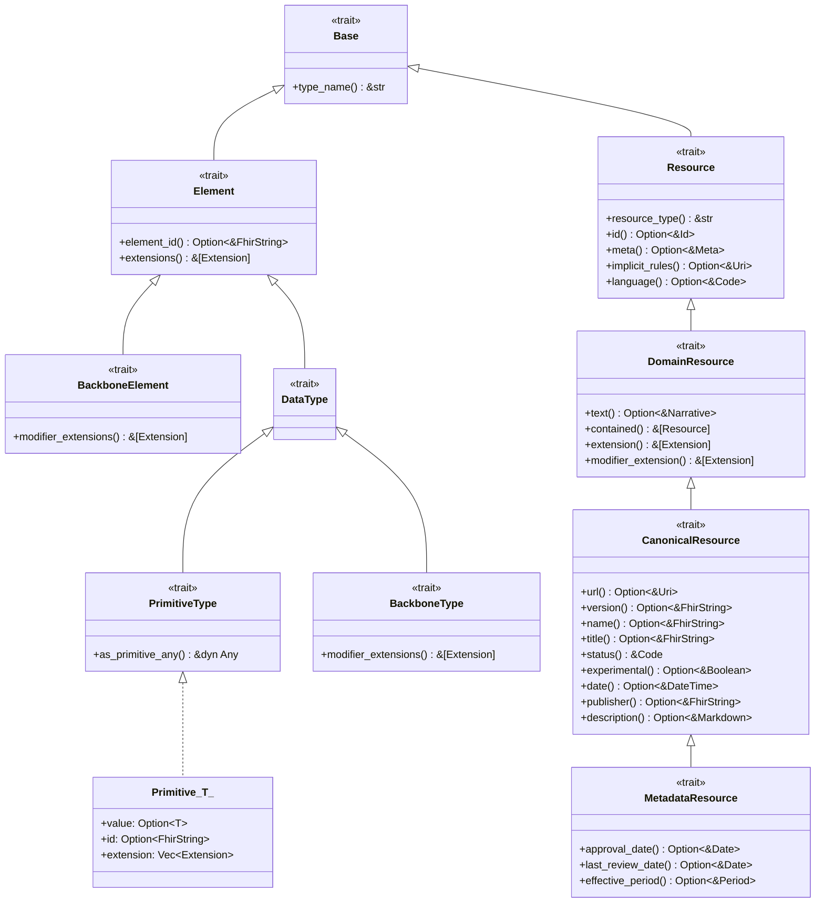
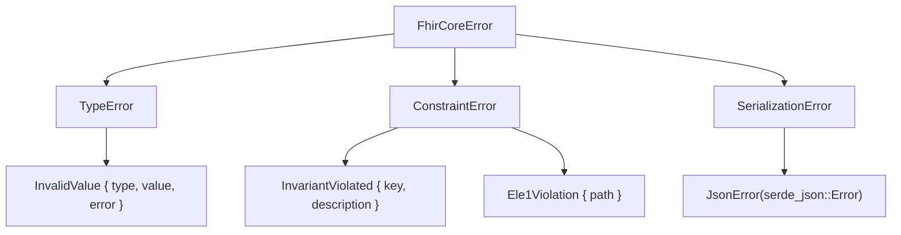

# Low-Level Design (LLD): `fhir-core` Type System

**Version:** 0.1.0  
**FHIR Specification:** Release 5 (R5) — [HL7 FHIR R5](https://hl7.org/fhir/R5/)  
**Crate Safety Invariants:** `#![forbid(unsafe_code)]`, zero non-serde runtime dependencies.

---

## 1. Executive Summary & Architectural Goals

The `fhir-core` crate provides the foundational type system, validation logic, and data structures for Fast Healthcare Interoperability Resources (FHIR) in Rust. It serves as the bedrock upon which resource models (e.g. `Patient`, `Observation`), validation engines, and FHIRPath interpreters are constructed.

### Core Design Principles

1. **Spec-Driven Strictness (HL7 FHIR R5 Normative)**:
   - Every primitive format, regex, numeric range, and structural invariant is verified directly against official HL7 FHIR R5 specifications.
   - Validation is proactive: instances constructed through safe APIs are guaranteed to satisfy all spec invariants.
2. **Zero-Cost & Zero-Allocation Views**:
   - Accessors return slices (`&str`) and primitives (`f64`, `i32`, `i64`, `bool`) without cloning.
   - Bypassable constructors (`new_unchecked`) exist for trusted sources, bulk imports, and internal parsing benchmarks.
3. **Ergonomic Serde Integration**:
   - Direct JSON and serde format compatibility with zero non-serde external dependencies.
   - Correct spec handling for JSON peculiarities (e.g. `integer64` as JSON string, `decimal` preserving precision, `_propertyName` companion fields for primitive element extensions and element IDs).
4. **Compile-Time Safety & Explicit Invariants**:
   - `#![forbid(unsafe_code)]` enforced crate-wide.
   - No implicit conversions that bypass domain validation (e.g., deliberate absence of `Deref<Target = str>`).
   - Standard conversion traits: `TryFrom<&str>`, `TryFrom<String>`, `FromStr`, `Display`, and `From`/`Into` for wrapped native primitives.

---

## 2. Type System Hierarchy

HL7 FHIR establishes an object-oriented type hierarchy starting from `Base`. In Rust, this hierarchy is modeled using traits, composable structs, and enums:



### 2.1 Trait Definitions

#### 2.1.1 Base & Element Family (`src/base.rs`, `src/element.rs`, `src/backbone.rs`, `src/datatype.rs`)

##### `Base` Trait (`src/base.rs`)
The root abstraction for every entity in the FHIR data model.
```rust
/// The root trait of all FHIR elements, data types, and resources.
pub trait Base: std::fmt::Debug + Send + Sync {
    /// Returns the normative FHIR type name (e.g., "string", "Observation", "CodeableConcept").
    fn type_name(&self) -> &'static str;
}
```

##### `Element` Trait (`src/element.rs`)
Base definition for all elements inside a FHIR resource or complex type:
```rust
use crate::types::FhirString;
use crate::datatypes::complex::Extension;

/// Common behavior for all FHIR elements that can hold an `id` and `extension` list.
pub trait Element: Base {
    /// Returns the element-level identifier, if present.
    fn element_id(&self) -> Option<&FhirString>;

    /// Returns the slice of extensions attached to this element.
    fn extensions(&self) -> &[Extension];
}
```

##### `BackboneElement` Trait (`src/backbone.rs`)
Defines compound elements within resources (not data types) that permit `modifierExtension`:
```rust
use crate::element::Element;
use crate::datatypes::complex::Extension;

/// Elements defined within resources that can modify the interpretation of parent elements.
pub trait BackboneElement: Element {
    /// Returns the slice of modifier extensions attached to this element.
    fn modifier_extensions(&self) -> &[Extension];
}
```

##### `DataType` Trait (`src/datatype.rs`)
The base definition for all reusable data types defined in the FHIR specification:
```rust
use crate::element::Element;

/// Marker/common trait for all FHIR reusable data types.
pub trait DataType: Element {}
```

##### `PrimitiveType` Trait (`src/datatype.rs`)
Specialization of `DataType` for types that carry a simple primitive value alongside optional `id` and `extension`:
```rust
use crate::datatype::DataType;

/// A reusable data type specializing `DataType` that holds a primitive value.
pub trait PrimitiveType: DataType {
    /// Returns true if this primitive element has a populated value.
    fn has_value(&self) -> bool;
}
```

##### `BackboneType` Trait (`src/datatype.rs`)
The base definition for complex data types permitted to carry `modifierExtension` (e.g. `Timing.repeat`, `Dosage.doseAndRate`):
```rust
use crate::datatype::DataType;
use crate::datatypes::complex::Extension;

/// Data types permitted to carry modifier extensions within reusable types.
pub trait BackboneType: DataType {
    /// Returns the slice of modifier extensions attached to this data type.
    fn modifier_extensions(&self) -> &[Extension];
}
```

#### 2.1.2 Resource Hierarchy Traits (`src/resource.rs`)

##### `Resource` Trait
The abstract base for all FHIR resources:
```rust
use crate::base::Base;
use crate::types::{Code, Id, Uri};

/// Root trait for all top-level FHIR resource instances.
pub trait Resource: Base {
    /// The normative FHIR resource type (e.g. "Patient", "Observation", "StructureDefinition").
    fn resource_type(&self) -> &'static str;

    /// The logical id of the resource.
    fn id(&self) -> Option<&Id>;

    /// Implicit rules URL under which the resource was created.
    fn implicit_rules(&self) -> Option<&Uri>;

    /// Base language of the resource.
    fn language(&self) -> Option<&Code>;
}
```

##### `DomainResource` Trait
Specialization of `Resource` adding clinical narrative, contained resources, extensions, and modifier extensions:
```rust
use crate::resource::Resource;
use crate::datatypes::complex::Extension;

/// A resource with narrative, extensions, and contained resources.
pub trait DomainResource: Resource {
    /// Slice of standard extensions attached to the resource.
    fn extensions(&self) -> &[Extension];

    /// Slice of modifier extensions attached to the resource.
    fn modifier_extensions(&self) -> &[Extension];
}
```

##### `CanonicalResource` Trait
Common interface for conformance and knowledge resources identified by a canonical URL (e.g. `StructureDefinition`, `ValueSet`, `CodeSystem`):
```rust
use crate::domain_resource::DomainResource;
use crate::types::{Boolean, Code, DateTime, FhirString, Markdown, Uri};

/// Common interface for resources that possess a canonical URL.
pub trait CanonicalResource: DomainResource {
    /// Canonical identifier for this resource, represented as a URI.
    fn url(&self) -> Option<&Uri>;

    /// Business version of the resource.
    fn version(&self) -> Option<&FhirString>;

    /// Computer-friendly name of the resource.
    fn name(&self) -> Option<&FhirString>;

    /// Human-friendly title of the resource.
    fn title(&self) -> Option<&FhirString>;

    /// Publication status (`draft` | `active` | `retired` | `unknown`).
    fn status(&self) -> &Code;

    /// For testing purposes, not real usage.
    fn experimental(&self) -> Option<&Boolean>;

    /// Date last changed.
    fn date(&self) -> Option<&DateTime>;

    /// Name of the publisher/organization.
    fn publisher(&self) -> Option<&FhirString>;

    /// Natural language description of the canonical resource.
    fn description(&self) -> Option<&Markdown>;
}
```

##### `MetadataResource` Trait
Common interface for knowledge and definition artifacts that carry extended governance and lifecycle metadata:
```rust
use crate::canonical_resource::CanonicalResource;
use crate::types::Date;
use crate::datatypes::complex::Period;

/// Common interface for knowledge artifacts carrying publication and review metadata.
pub trait MetadataResource: CanonicalResource {
    /// The date on which the resource content was approved by the publisher.
    fn approval_date(&self) -> Option<&Date>;

    /// The date on which the resource content was last reviewed.
    fn last_review_date(&self) -> Option<&Date>;

    /// The period during which the metadata resource content was or is planned to be effective.
    fn effective_period(&self) -> Option<&Period>;
}
```

---

## 3. The 20 FHIR R5 Primitive Types

FHIR R5 defines exactly 20 primitive types. Each primitive lives in `src/types/<type_name>/` and implements:
- Infallible or fallible `new(val)`
- `new_unchecked(val)`
- `validate(&str) -> Result<(), SpecificError>`
- `TryFrom<&str, Error = TypeError>`, `TryFrom<String, Error = TypeError>`, `FromStr`
- `Display`
- `Serialize` and `Deserialize` (feature-gated on `serde`)

### 3.1 Primitives Specification Matrix

| Primitive | Rust Type | Representation | HL7 R5 Pattern / Invariant | Serde JSON Encoding |
| :--- | :--- | :--- | :--- | :--- |
| `base64Binary` | `Base64Binary` | `String` | RFC 4648 Base64: `(\s*([0-9a-zA-Z\+\=]){4}\s*)+` | JSON string |
| `boolean` | `Boolean` | `bool` | `true \| false` | JSON boolean |
| `canonical` | `Canonical` | `String` | RFC 3986 URI + optional `\|version` / `#frag` (`\S*`) | JSON string |
| `code` | `Code` | `String` | `[^\s]+( [^\s]+)*` (no lead/trail ws, no multi-space) | JSON string |
| `date` | `Date` | `String` | `YYYY`, `YYYY-MM`, or `YYYY-MM-DD` | JSON string |
| `dateTime` | `DateTime` | `String` | `YYYY`, `YYYY-MM`, `YYYY-MM-DD`, or ISO-8601 with TZ | JSON string |
| `decimal` | `Decimal` | `String` | `-?(0\|[1-9][0-9]{0,17})(\.[0-9]{1,17})?([eE][+-]?[0-9]{1,9})?` | JSON number |
| `id` | `Id` | `String` | `[A-Za-z0-9\-\.]{1,64}` | JSON string |
| `instant` | `Instant` | `String` | `YYYY-MM-DDThh:mm:ss[.sss](Z\|[+-]hh:mm)` (sec + TZ required) | JSON string |
| `integer` | `Integer` | `i32` | `[+-]?(0\|[1-9][0-9]*)`, $-2^{31} .. 2^{31}-1$ | JSON number |
| `integer64` | `Integer64` | `i64` | `[+-]?(0\|[1-9][0-9]*)`, $-2^{63} .. 2^{63}-1$ | **JSON string** (per spec) |
| `markdown` | `Markdown` | `String` | `\s*(\S\|\s)*`, max 1,048,576 chars | JSON string |
| `oid` | `Oid` | `String` | `urn:oid:[0-2](\.(0\|[1-9][0-9]*))+` | JSON string |
| `positiveInt`| `PositiveInt`| `u32` (range $\ge 1$)| `[1-9][0-9]*`, $1 .. 2,147,483,647$ | JSON number |
| `string` | `FhirString` | `String` | `[ \r\n\t\S]+`, max 1MB, no control chars | JSON string |
| `time` | `Time` | `String` | `hh:mm:ss[.sss]` (leap seconds allowed) | JSON string |
| `unsignedInt`| `UnsignedInt`| `u32` (range $\ge 0$)| `[0]\|([1-9][0-9]*)`, $0 .. 2,147,483,647$ | JSON number |
| `uri` | `Uri` | `String` | RFC 3986 URI: `\S*` | JSON string |
| `url` | `Url` | `String` | RFC 1738/3986 URL: `\S*` | JSON string |
| `uuid` | `Uuid` | `String` | `urn:uuid:[0-9a-f]{8}-[0-9a-f]{4}-[0-9a-f]{4}-[0-9a-f]{4}-[0-9a-f]{12}` | JSON string |

---

## 4. Primitive Element Wrapper (`Primitive<T>`) & FHIR JSON Architecture

In FHIR, primitive fields are full `Element` instances. They can carry metadata (`id` and `extension`) even when the primary value is absent (e.g. data-absent-reason).

### 4.1 Memory Representation

```rust
use crate::element::Element;
use crate::base::Base;
use crate::types::FhirString;
use crate::datatypes::complex::Extension;
use crate::errors::r#type::TypeError;

/// A wrapper representing a FHIR primitive element.
///
/// Implements FHIR Invariant `ele-1`: "All FHIR elements must have a @value or children".
#[derive(Debug, Clone, PartialEq)]
pub struct Primitive<T> {
    /// The primary primitive value, or `None` if absent.
    pub value: Option<T>,
    /// Optional resource-local element identifier.
    pub id: Option<FhirString>,
    /// Optional list of extensions attached to this primitive.
    pub extension: Vec<Extension>,
}

impl<T> Primitive<T> {
    /// Creates a new `Primitive` with only a value.
    pub fn new(value: T) -> Self {
        Self {
            value: Some(value),
            id: None,
            extension: Vec::new(),
        }
    }

    /// Enforces FHIR Invariant `ele-1`: returns `true` if value, id, or extension is present.
    #[inline]
    pub fn is_valid_element(&self) -> bool {
        self.value.is_some() || self.id.is_some() || !self.extension.is_empty()
    }
}
```

### 4.2 FHIR JSON Companion Underscore (`_propertyName`) Pattern

In FHIR JSON:
- Simple element: `{"gender": "male"}`
- Element with extension: `{"gender": "male", "_gender": {"id": "g1", "extension": [...]}}`
- Missing value with extension: `{"_gender": {"extension": [{"url": "...", "valueCode": "unknown"}]}}`

#### Serialization Strategy
1. **Direct Value Serialization**: If `id` is `None` and `extension` is empty, `Primitive<T>` serializes directly as its underlying value `T`.
2. **Resource/Container Serialization**: Struct serializers handle splitting the value and the `_propertyName` companion object using a custom serde field attribute or helper serializer (`#[serde(with = "fhir_primitive")]`).

---

## 5. Foundational Complex Data Types (`src/datatypes/complex/`)

FHIR R5 defines general-purpose reusable data types. The initial core implementations include:

### 5.1 `Extension`
```rust
use crate::base::Base;
use crate::element::Element;
use crate::types::{FhirString, Uri};
use crate::datatypes::choices::ExtensionValue;

/// An Extension element for capturing metadata outside the standard resource model.
///
/// Invariant `ext-1`: "Must have either extensions or value[x], not both".
#[derive(Debug, Clone, PartialEq)]
pub struct Extension {
    pub id: Option<FhirString>,
    pub extension: Vec<Extension>,
    pub url: Uri,
    pub value: Option<ExtensionValue>,
}
```

### 5.2 `Coding` & `CodeableConcept`
```rust
use crate::types::{Boolean, Code, FhirString, Uri};

#[derive(Debug, Clone, PartialEq, Default)]
pub struct Coding {
    pub id: Option<FhirString>,
    pub extension: Vec<Extension>,
    pub system: Option<Uri>,
    pub version: Option<FhirString>,
    pub code: Option<Code>,
    pub display: Option<FhirString>,
    pub user_selected: Option<Boolean>,
}

#[derive(Debug, Clone, PartialEq, Default)]
pub struct CodeableConcept {
    pub id: Option<FhirString>,
    pub extension: Vec<Extension>,
    pub coding: Vec<Coding>,
    pub text: Option<FhirString>,
}
```

### 5.3 `Identifier`
```rust
use crate::types::{Code, FhirString, Uri};
use crate::datatypes::complex::{CodeableConcept, Period, Reference};

#[derive(Debug, Clone, PartialEq, Default)]
pub struct Identifier {
    pub id: Option<FhirString>,
    pub extension: Vec<Extension>,
    pub r#use: Option<Code>,
    pub r#type: Option<CodeableConcept>,
    pub system: Option<Uri>,
    pub value: Option<FhirString>,
    pub period: Option<Period>,
    pub assigner: Option<Reference>,
}
```

### 5.4 `Period`
```rust
use crate::types::{DateTime, FhirString};
use crate::errors::constraints::ConstraintError;

/// A time period defined by a start and end date/time.
///
/// Invariant `per-1`: "If present, start SHALL be <= end".
#[derive(Debug, Clone, PartialEq, Default)]
pub struct Period {
    pub id: Option<FhirString>,
    pub extension: Vec<Extension>,
    pub start: Option<DateTime>,
    pub end: Option<DateTime>,
}

impl Period {
    pub fn validate_period(&self) -> Result<(), ConstraintError> {
        if let (Some(start), Some(end)) = (&self.start, &self.end) {
            if start.as_str() > end.as_str() {
                return Err(ConstraintError::InvariantViolated {
                    key: "per-1",
                    description: "Period.start must be less than or equal to Period.end".into(),
                });
            }
        }
        Ok(())
    }
}
```

### 5.5 `Quantity`
```rust
use crate::types::{Code, Decimal, FhirString, Uri};
use crate::errors::constraints::ConstraintError;

/// A measured or measurable amount.
///
/// Invariant `qty-3`: "If a code for the unit is present, the system SHALL also be present".
#[derive(Debug, Clone, PartialEq, Default)]
pub struct Quantity {
    pub id: Option<FhirString>,
    pub extension: Vec<Extension>,
    pub value: Option<Decimal>,
    pub comparator: Option<Code>,
    pub unit: Option<FhirString>,
    pub system: Option<Uri>,
    pub code: Option<Code>,
}

impl Quantity {
    pub fn validate_quantity(&self) -> Result<(), ConstraintError> {
        if self.code.is_some() && self.system.is_none() {
            return Err(ConstraintError::InvariantViolated {
                key: "qty-3",
                description: "Quantity.system must be provided when Quantity.code is present".into(),
            });
        }
        Ok(())
    }
}
```

### 5.6 `Reference`
```rust
use crate::types::{FhirString, Uri};
use crate::datatypes::complex::Identifier;

#[derive(Debug, Clone, PartialEq, Default)]
pub struct Reference {
    pub id: Option<FhirString>,
    pub extension: Vec<Extension>,
    pub reference: Option<FhirString>,
    pub r#type: Option<Uri>,
    pub identifier: Option<Identifier>,
    pub display: Option<FhirString>,
}
```

---

## 6. Choice Types (`[x]`) Architecture

FHIR utilizes polymorphic `[x]` elements (e.g. `value[x]`, `onset[x]`). In `fhir-core`, choice types are represented as Rust tagged enums with custom serde dispatch:

```rust
use crate::types::*;

/// Representation of `Extension.value[x]`.
#[derive(Debug, Clone, PartialEq)]
pub enum ExtensionValue {
    Base64Binary(Base64Binary),
    Boolean(Boolean),
    Canonical(Canonical),
    Code(Code),
    Date(Date),
    DateTime(DateTime),
    Decimal(Decimal),
    Id(Id),
    Instant(Instant),
    Integer(Integer),
    Integer64(Integer64),
    Markdown(Markdown),
    Oid(Oid),
    PositiveInt(PositiveInt),
    String(FhirString),
    Time(Time),
    UnsignedInt(UnsignedInt),
    Uri(Uri),
    Url(Url),
    Uuid(Uuid),
    // Complex types supported in extensions:
    Coding(crate::datatypes::complex::Coding),
    CodeableConcept(crate::datatypes::complex::CodeableConcept),
    Quantity(crate::datatypes::complex::Quantity),
    Period(crate::datatypes::complex::Period),
    Reference(crate::datatypes::complex::Reference),
}
```

---

## 7. Error Handling Architecture

The crate errors are structured into a 2-tier hierarchy:



1. **`TypeError` (`src/errors/type.rs`)**:
   - Validation failure at the single primitive/datatype level.
2. **`ConstraintError` (`src/errors/constraints.rs`)**:
   - Validation failure across multiple fields or invariants (`ele-1`, `ext-1`, `per-1`, `qty-3`).
3. **`FhirCoreError` (`src/errors/mod.rs`)**:
   - The top-level crate error enum unifying `TypeError`, `ConstraintError`, and format-specific serialization errors.

---

## 8. Directory Layout

```
fhir-core/
├── Cargo.toml
├── Makefile
├── docs/
│   ├── LLD.md               <-- This Document
│   └── TDD.md               <-- Test-Driven Development Plan
└── src/
    ├── lib.rs
    ├── base.rs              <-- Base trait
    ├── element.rs           <-- Element trait & Primitive<T>
    ├── backbone.rs          <-- BackboneElement trait
    ├── errors/
    │   ├── mod.rs           <-- FhirCoreError
    │   ├── type.rs          <-- TypeError
    │   ├── constraints.rs   <-- ConstraintError (ele-1, ext-1, etc.)
    │   └── test.rs
    ├── types/               <-- 20 FHIR R5 Primitive Types
    │   ├── mod.rs
    │   ├── base64/          {mod.rs, test.rs}
    │   ├── boolean/         {mod.rs, test.rs}
    │   ├── canonical/       {mod.rs, test.rs}
    │   ├── code/            {mod.rs, test.rs}
    │   ├── date/            {mod.rs, test.rs}
    │   ├── dateTime/        {mod.rs, test.rs}
    │   ├── decimal/         {mod.rs, test.rs}
    │   ├── id/              {mod.rs, test.rs}
    │   ├── instant/         {mod.rs, test.rs}
    │   ├── integer/         {mod.rs, test.rs}
    │   ├── integer64/       {mod.rs, test.rs}
    │   ├── markdown/        {mod.rs, test.rs}
    │   ├── oid/             {mod.rs, test.rs}
    │   ├── positiveInt/     {mod.rs, test.rs}
    │   ├── string/          {mod.rs, test.rs}
    │   ├── time/            {mod.rs, test.rs}
    │   ├── unsignedInt/     {mod.rs, test.rs}
    │   ├── uri/             {mod.rs, test.rs}
    │   ├── url/             {mod.rs, test.rs}
    │   └── uuid/            {mod.rs, test.rs}
    ├── datatypes/           <-- Reusable FHIR Data Types
    │   ├── mod.rs
    │   ├── primitive/       <-- Primitive element models
    │   │   └── mod.rs
    │   ├── choices.rs       <-- Polymorphic choice types (ExtensionValue)
    │   └── complex/         <-- General Purpose Complex Types
    │       ├── mod.rs
    │       ├── extension.rs
    │       ├── coding.rs
    │       ├── codeable_concept.rs
    │       ├── identifier.rs
    │       ├── period.rs
    │       ├── quantity.rs
    │       └── reference.rs
    └── r5/                  <-- Future R5 Resource models
```
