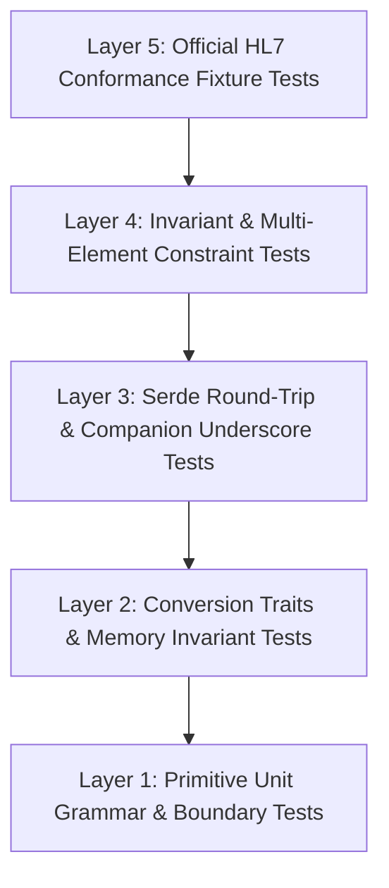
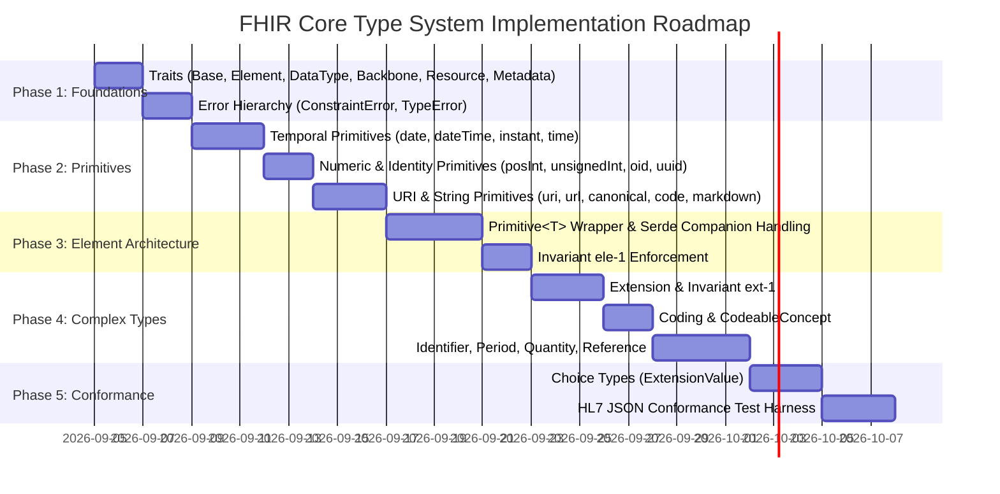

# Test-Driven Development (TDD) Plan: `fhir-core`

**Version:** 0.1.0  
**Target Standard:** HL7 FHIR Release 5 (R5)  
**CI Gate:** `make check` (zero warnings, 100% tests passing, zero clippy lints, zero missing docs).

---

## 1. TDD Philosophy & Engineering Principles

In `fhir-core`, testing is not an afterthought; it is the executable specification of compliance with the HL7 FHIR R5 standard.

### Core Testing Invariants
1. **Test-First Development (Red $\to$ Green $\to$ Refactor)**:
   - For every type, module, or feature, tests in `test.rs` must be authored before the implementation.
   - Every negative test asserts the exact granular error variant (e.g. `IdError::InvalidCharacter { char: ' ', index: 3 }`), not merely `is_err()`.
2. **Zero Unchecked Assumptions**:
   - Grammar, regex patterns, and length limits are cross-referenced directly with [HL7 FHIR R5 Datatypes](https://hl7.org/fhir/R5/datatypes.html).
   - Tests explicitly target the boundaries of every regex (e.g., character classes, adjacent ASCII codes, leading zeros, signs).
3. **Spec Invariant Validation**:
   - Invariants like `ele-1` (elements must have a value or children), `ext-1` (extensions must have value or nested extensions, not both), and `per-1` (start $\le$ end) have dedicated failure test suites.
4. **Isolated Sibling Test Modules**:
   - Unit tests live in a sibling `test.rs` file within the type's module directory (e.g., `src/types/date/test.rs`), maintaining clean separation of concerns.

---

## 2. The 5-Layer Test Pyramid



### Layer 1: Primitive Unit Grammar & Boundary Tests
- Verifies raw string parsing, regular expression conformance, length caps, and whitespace handling.
- Covers positive valid samples, negative invalid samples, and adjacent ASCII character boundaries.

### Layer 2: Conversion Traits & Memory Invariant Tests
- Verifies `TryFrom<&str>`, `TryFrom<String>`, `FromStr`, `Display`, `into_inner()`, and `new_unchecked()`.
- Verifies that `new_unchecked()` stores the verbatim value and preserves memory layout.

### Layer 3: Serde Serialization & Deserialization Tests
- Verifies standard JSON serialization (`to_string`) and deserialization (`from_str`, `from_reader`, `from_value`).
- Verifies correct JSON token representations (e.g., `integer64` as JSON string, `decimal` as JSON number).
- Verifies primitive companion underscore field handling (`_propertyName`).

### Layer 4: Invariant & Multi-Element Constraint Tests
- Enforces FHIR core invariants across complex structures (`ele-1`, `ext-1`, `per-1`, `qty-3`, `rng-2`).

### Layer 5: Official HL7 Conformance Fixture Tests
- Integration tests using official HL7 FHIR R5 JSON schema definitions and test examples (`examples-json.zip`).

---

## 3. Test Matrices for the 20 Primitive Data Types

### 3.1 Primitives Status & Target Matrix

| Primitive | Status | Happy Path Vectors | Negative / Edge Vectors |
| :--- | :--- | :--- | :--- |
| `base64Binary` | **Complete** | `"TWFu"`, `"AAAA"`, with internal whitespace | Odd lengths, illegal chars (`@`, `!`), invalid padding (`===`) |
| `boolean` | **Complete** | `true`, `false`, `"true"`, `"false"` | `"True"`, `"FALSE"`, `"yes"`, `"1"`, `""` |
| `decimal` | **Complete** | `"0"`, `"-0"`, `"0.010"`, `"42.5"`, `"1e3"`, `"-1.2E-3"` | `"+42"`, `".5"`, `"5."`, `"0123"`, non-numeric, finite check |
| `id` | **Complete** | `"a"`, `"patient-1234"`, `"Observation.1"`, 64-char string | `""`, 65-char string, spaces, `_`, `/`, `@`, unicode |
| `integer` | **Complete** | `0`, `42`, `-100`, `"+42"`, `"0"`, `i32::MIN`, `i32::MAX` | `"-0"`, `"+0"`, `"01"`, `i32::MAX + 1`, `42.5`, letters |
| `integer64` | **Complete** | `0`, `42`, `i64::MIN`, `i64::MAX`, serialized as `"42"` | `"-0"`, `"+0"`, `"01"`, `i64::MAX + 1`, raw JSON numbers |
| `string` | **Complete** | `"Hello"`, unicode text, multiline text with `\n` | `""`, whitespace-only (`"   "`), ASCII control chars (`\0`) |
| `canonical` | *Pending* | `"http://hl7.org/fhir/StructureDefinition/Patient"`, `"uri\|1.0#frag"` | Strings with internal whitespace (`"http://example .org"`) |
| `code` | *Pending* | `"active"`, `"oral-route"`, `"code with single spaces"` | `""`, `" leading"`, `"trailing "`, `"double  spaces"`, `"\t"` |
| `date` | *Pending* | `"2020"`, `"2020-05"`, `"2020-05-15"` | `"2020-5"`, `"2020-13-01"`, `"2020-02-30"`, `"0000"`, `"2020-00"` |
| `dateTime` | *Pending* | `"2020"`, `"2020-05-15T10:30:00Z"`, `"2020-05-15T10:30:00+02:00"` | Missing timezone on time (`"2020-05-15T10:30:00"`), bad leap year |
| `instant` | *Pending* | `"2020-05-15T10:30:00Z"`, `"2020-05-15T10:30:00.123456789+05:30"` | Partial date (`"2020-05-15"`), missing seconds, offset `> 14:00` |
| `markdown` | *Pending* | `"# Header\n\n**bold**"`, `"   "`, `""` | Strings exceeding 1,048,576 characters |
| `oid` | *Pending* | `"urn:oid:1.2.3.4"`, `"urn:oid:2.999.1"` | `"1.2.3.4"` (missing prefix), `"urn:oid:3.1"`, `"urn:oid:1.01"` |
| `positiveInt`| *Pending* | `1`, `42`, `2147483647`, `"1"`, `"+1"` | `0`, `-1`, `"+0"`, `"01"`, `2147483648`, `""` |
| `time` | *Pending* | `"00:00:00"`, `"23:59:59"`, `"14:30:00.123"`, `"23:59:60"` | `"24:00:00"`, `"12:60:00"`, `"12:00"`, `"12"`, `"-01:00:00"` |
| `unsignedInt`| *Pending* | `0`, `1`, `2147483647`, `"0"`, `"1"` | `-1`, `"-0"`, `"+0"`, `"01"`, `2147483648`, `""` |
| `uri` | *Pending* | `"http://example.org"`, `"urn:uuid:123"`, `"/relative/path"` | Whitespace-containing strings (`"http://ex ample.org"`) |
| `url` | *Pending* | `"http://example.org/index.html"`, `"https://fhir.org"` | Internal whitespace, non-URL characters |
| `uuid` | *Pending* | `"urn:uuid:c707a726-25f0-466d-9788-b2ef562d4e78"` | Upper case (`"urn:uuid:C707..."`), missing `"urn:uuid:"` prefix |

---

## 4. Complex Types Test Specification

### 4.1 Invariant `ele-1`: `All FHIR elements must have a @value or children`
Every `Element` implementation (`Primitive<T>`, `Extension`, `Coding`, etc.) must fail validation if:
1. `value` is `None`, AND
2. `id` is `None`, AND
3. `extension` list is empty.

#### Test Cases (`tests/ele1_invariant.rs`):
```rust
#[test]
fn test_ele1_primitive_without_value_or_extension_fails() {
    let empty_primitive: Primitive<FhirString> = Primitive {
        value: None,
        id: None,
        extension: Vec::new(),
    };
    assert!(!empty_primitive.is_valid_element());
}

#[test]
fn test_ele1_primitive_with_only_extension_succeeds() {
    let ext_only: Primitive<FhirString> = Primitive {
        value: None,
        id: None,
        extension: vec![Extension {
            id: None,
            extension: Vec::new(),
            url: Uri::new("http://hl7.org/fhir/StructureDefinition/data-absent-reason").unwrap(),
            value: Some(ExtensionValue::Code(Code::new("unknown").unwrap())),
        }],
    };
    assert!(ext_only.is_valid_element());
}
```

### 4.2 Invariant `ext-1`: `Must have either extensions or value[x], not both`
An `Extension` instance must contain either a choice `value` or nested `extension` children, never both.

#### Test Cases (`src/datatypes/complex/extension/test.rs`):
```rust
#[test]
fn test_ext1_cannot_have_both_value_and_nested_extensions() {
    let invalid_ext = Extension {
        id: None,
        url: Uri::new("http://example.org/fhir/ext").unwrap(),
        value: Some(ExtensionValue::Boolean(Boolean::new(true))),
        extension: vec![Extension {
            id: None,
            url: Uri::new("http://example.org/fhir/sub").unwrap(),
            value: None,
            extension: Vec::new(),
        }],
    };
    assert!(invalid_ext.validate_extension().is_err());
}
```

### 4.3 Invariant `per-1`: `Period.start <= Period.end`
A `Period` must ensure its chronological ordering.

#### Test Cases (`src/datatypes/complex/period/test.rs`):
```rust
#[test]
fn test_per1_start_after_end_fails() {
    let period = Period {
        id: None,
        extension: Vec::new(),
        start: Some(DateTime::try_from("2025-01-02").unwrap()),
        end: Some(DateTime::try_from("2025-01-01").unwrap()),
    };
    assert!(period.validate_period().is_err());
}

#[test]
fn test_per1_start_equal_or_before_end_succeeds() {
    let period = Period {
        id: None,
        extension: Vec::new(),
        start: Some(DateTime::try_from("2025-01-01").unwrap()),
        end: Some(DateTime::try_from("2025-01-01").unwrap()),
    };
    assert!(period.validate_period().is_ok());
}
```

---

## 5. Serde Companion Underscore (`_propertyName`) Test Suite

FHIR primitive values are separated into the raw value and an underscore companion object when extensions or element IDs exist.

#### Test Cases (`tests/serde_primitive_companion.rs`):
```rust
#[test]
fn test_deserialize_primitive_with_companion_extension() {
    let json_data = r#"{
        "gender": "male",
        "_gender": {
            "id": "gender-id-1",
            "extension": [
                {
                    "url": "http://hl7.org/fhir/StructureDefinition/rendered-value",
                    "valueString": "Male"
                }
            ]
        }
    }"#;

    // Deserialization maps "gender" and "_gender" into a single Primitive<Code> field:
    let parsed: PatientGenderContainer = serde_json::from_str(json_data).unwrap();
    assert_eq!(parsed.gender.value.as_ref().unwrap().as_str(), "male");
    assert_eq!(parsed.gender.id.as_ref().unwrap().as_str(), "gender-id-1");
    assert_eq!(parsed.gender.extension.len(), 1);
}

#[test]
fn test_serialize_primitive_splits_into_companion() {
    let element = Primitive {
        value: Some(Code::new("male").unwrap()),
        id: Some(FhirString::new("gender-id-1").unwrap()),
        extension: Vec::new(),
    };
    let container = PatientGenderContainer { gender: element };
    let serialized = serde_json::to_string(&container).unwrap();

    assert!(serialized.contains(r#""gender":"male""#));
### 4.4 Trait Hierarchy & Interface Conformance Tests

To prevent drift in the FHIR type hierarchy, tests explicitly assert compile-time and runtime trait bounds:

```rust
#[test]
fn test_datatype_hierarchy_trait_bounds() {
    fn assert_is_datatype<T: DataType + Element + Base>() {}
    fn assert_is_primitive_type<T: PrimitiveType + DataType + Element + Base>() {}
    fn assert_is_backbone_type<T: BackboneType + DataType + Element + Base>() {}

    // Primitive<T> satisfies PrimitiveType and DataType
    assert_is_primitive_type::<Primitive<FhirString>>();
}

#[test]
fn test_resource_hierarchy_trait_bounds() {
    fn assert_is_resource<T: Resource + Base>() {}
    fn assert_is_domain_resource<T: DomainResource + Resource + Base>() {}
    fn assert_is_canonical_resource<T: CanonicalResource + DomainResource + Resource + Base>() {}
    fn assert_is_metadata_resource<T: MetadataResource + CanonicalResource + DomainResource + Resource + Base>() {}
}
```

---

## 5. Serde Companion Underscore (`_propertyName`) Test Suite

FHIR primitive values are separated into the raw value and an underscore companion object when extensions or element IDs exist.

#### Test Cases (`tests/serde_primitive_companion.rs`):
```rust
#[test]
fn test_deserialize_primitive_with_companion_extension() {
    let json_data = r#"{
        "gender": "male",
        "_gender": {
            "id": "gender-id-1",
            "extension": [
                {
                    "url": "http://hl7.org/fhir/StructureDefinition/rendered-value",
                    "valueString": "Male"
                }
            ]
        }
    }"#;

    // Deserialization maps "gender" and "_gender" into a single Primitive<Code> field:
    let parsed: PatientGenderContainer = serde_json::from_str(json_data).unwrap();
    assert_eq!(parsed.gender.value.as_ref().unwrap().as_str(), "male");
    assert_eq!(parsed.gender.id.as_ref().unwrap().as_str(), "gender-id-1");
    assert_eq!(parsed.gender.extension.len(), 1);
}

#[test]
fn test_serialize_primitive_splits_into_companion() {
    let element = Primitive {
        value: Some(Code::new("male").unwrap()),
        id: Some(FhirString::new("gender-id-1").unwrap()),
        extension: Vec::new(),
    };
    let container = PatientGenderContainer { gender: element };
    let serialized = serde_json::to_string(&container).unwrap();

    assert!(serialized.contains(r#""gender":"male""#));
    assert!(serialized.contains(r#""_gender":{"id":"gender-id-1"}"#));
}
```

---

## 6. Phased Implementation Roadmap



### Milestone Checklist:
- [x] Primitive types: `base64Binary`, `boolean`, `decimal`, `id`, `integer`, `integer64`, `string`
- [ ] Milestone 1: Complete Trait System:
  - Data Types: `Base`, `Element`, `BackboneElement`, `DataType`, `PrimitiveType`, `BackboneType`
  - Resource Hierarchy: `Resource`, `DomainResource`, `CanonicalResource`, `MetadataResource`
  - Error Hierarchy: `ConstraintError` (ele-1, ext-1, per-1, qty-3) and `FhirCoreError`
- [ ] Milestone 2: Temporal primitives (`date`, `dateTime`, `instant`, `time`)
- [ ] Milestone 3: Numeric & URI primitives (`positiveInt`, `unsignedInt`, `oid`, `uuid`, `uri`, `url`, `canonical`, `code`, `markdown`)
- [ ] Milestone 4: `Primitive<T>` element wrapper with companion `_propertyName` serialization
- [ ] Milestone 5: Complex types (`Extension`, `Coding`, `CodeableConcept`, `Identifier`, `Period`, `Quantity`, `Reference`)
- [ ] Milestone 6: Polymorphic choice types (`ExtensionValue`) & conformance suite
