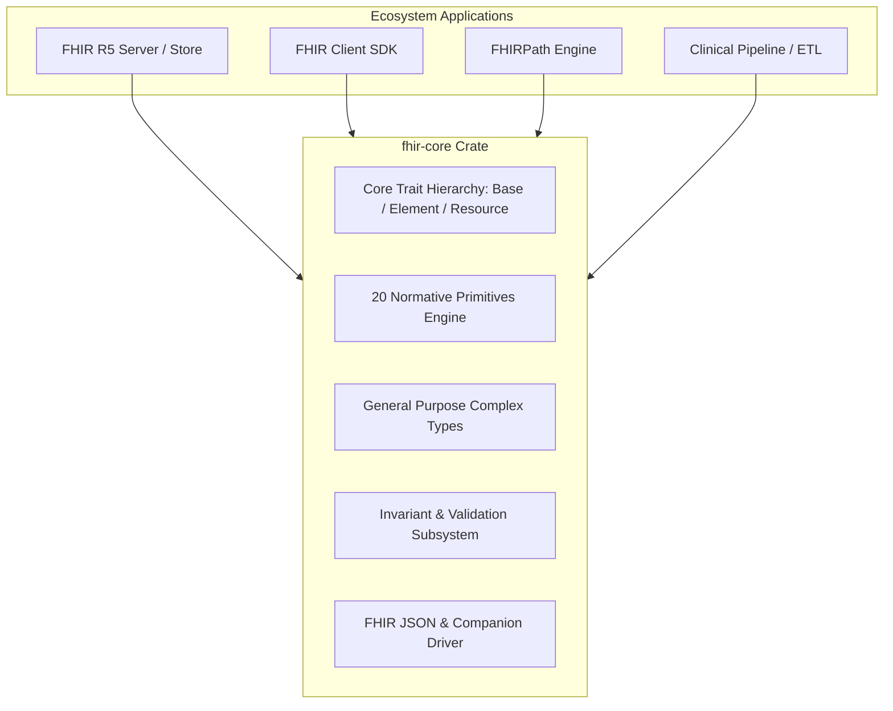
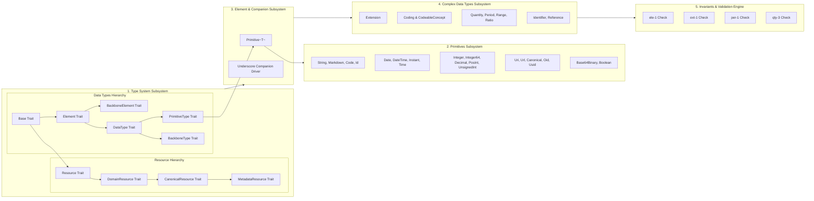
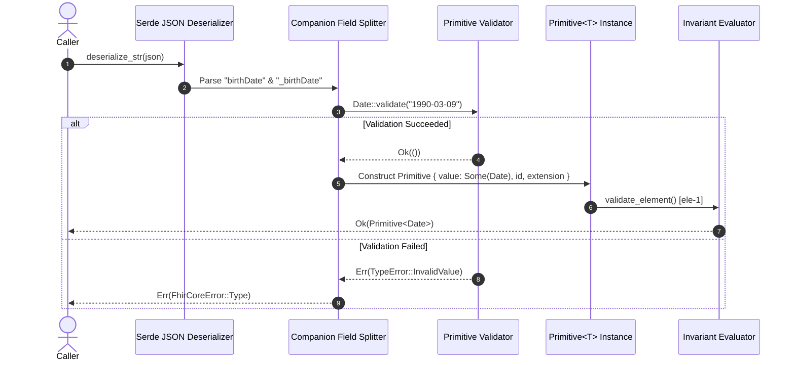

# Technical Design Document (TDD): `fhir-core`

**Document Version:** 1.0.0  
**Status:** Approved for Implementation  
**Standard:** HL7 FHIR Release 5 (R5) Normative  
**MSRV:** Rust 1.87 (Edition 2024)  
**Safety Mandate:** `#![forbid(unsafe_code)]`, zero non-serde runtime dependencies.

---

## 1. System Overview & Context

`fhir-core` is the foundational Rust library providing the canonical type system, validation logic, and data structures for Fast Healthcare Interoperability Resources ([HL7 FHIR](https://hl7.org/fhir/)). It is designed to act as the core engine for higher-level healthcare software, including FHIR servers, client SDKs, ETL pipelines, clinical data repositories, and FHIRPath query engines.



### 1.1 Non-Goals
- **No Resource Bloat in Core**: This crate does not bundle hundreds of generated FHIR resource definitions (e.g. `Patient`, `Observation`) into the core compilation unit; rather, it provides the strict primitives, complex types, traits, and serialization infrastructure that generated or hand-coded resources build on.
- **No Heavy Runtime Dependencies**: The crate explicitly forbids pulling in regex crates, bignum libraries, or asynchronous runtimes. All validation is implemented with hand-rolled, zero-allocation ASCII state machines.

---

## 2. Architectural Drivers & Quality Attributes (NFRs)

| Attribute | Target Metric | Architectural Strategy |
| :--- | :--- | :--- |
| **Safety** | `#![forbid(unsafe_code)]` | 100% safe Rust across all modules and tests. No `unsafe` blocks permitted. |
| **Dependencies** | 0 non-serde dependencies | Only optional `serde` dependency allowed in production builds. |
| **Memory Efficiency** | Minimal heap allocation | Immutable slices (`&str`) returned for all string-backed primitives; numeric types store native primitives (`i32`, `i64`, `bool`, `u32`). |
| **Validation Fidelity** | 100% HL7 R5 Conformance | Strict enforcement of spec regexes, whitespace rules, character boundaries, and multi-field invariants (`ele-1`, `ext-1`, `per-1`, `qty-3`). |
| **Deterministic Errors** | Granular, typed diagnostics | Typed error variants exposing byte index, offending char, or exact count rather than generic string errors. |
| **Modern Rust Baseline** | Edition 2024, MSRV 1.87 | Leverages modern standard library features, let-chains, and edition 2024 idioms. |

---

## 3. High-Level Subsystem Architecture

The system is decomposed into five primary subsystems:



### 3.1 Subsystem Responsibilities

1. **Type System Subsystem (`src/base.rs`, `src/element.rs`, `src/backbone.rs`, `src/datatype.rs`, `src/resource.rs`)**:
   - **Data Types Hierarchy**:
     - [`Base`](file:///Users/revanth/Projects/fhir-core/docs/LLD.md#211-base--element-family-srcbasers-srcelementrs-srcbackboners-srcdatatypers): Root interface for all FHIR entities.
     - [`Element`](file:///Users/revanth/Projects/fhir-core/docs/LLD.md#element-trait-srcelementrs): Foundation for all elements, introducing optional `id` and `extension`.
     - [`BackboneElement`](file:///Users/revanth/Projects/fhir-core/docs/LLD.md#backboneelement-trait-srcbackboners): Specialized compound elements defined within resources that allow `modifierExtension`.
     - [`DataType`](file:///Users/revanth/Projects/fhir-core/docs/LLD.md#datatype-trait-srcdatatypers): Base for all reusable data types.
     - [`PrimitiveType`](file:///Users/revanth/Projects/fhir-core/docs/LLD.md#primitivetype-trait-srcdatatypers): Direct subtype of `DataType` that holds primitive values (e.g. `Primitive<T>`).
     - [`BackboneType`](file:///Users/revanth/Projects/fhir-core/docs/LLD.md#backbonetype-trait-srcdatatypers): Direct subtype of `DataType` permitting `modifierExtension` within reusable complex types (e.g. `Timing.repeat`).
   - **Resource Hierarchy**:
     - [`Resource`](file:///Users/revanth/Projects/fhir-core/docs/LLD.md#resource-trait): Root interface for top-level resources (`id`, `meta`, `implicitRules`, `language`).
     - [`DomainResource`](file:///Users/revanth/Projects/fhir-core/docs/LLD.md#domainresource-trait): Adds narrative (`text`), `contained` resources, `extension`, and `modifierExtension`.
     - [`CanonicalResource`](file:///Users/revanth/Projects/fhir-core/docs/LLD.md#canonicalresource-trait): Common interface for resources with a canonical URL (`url`, `version`, `status`, etc.).
     - [`MetadataResource`](file:///Users/revanth/Projects/fhir-core/docs/LLD.md#metadataresource-trait): Common interface extending `CanonicalResource` for definition and knowledge artifacts with lifecycle governance (`approvalDate`, `lastReviewDate`, `effectivePeriod`, `topic`, `author`, `editor`, `reviewer`, `endorser`, `relatedArtifact`).
   - Provides runtime type identification (`type_name()`) for reflective and FHIRPath operations.
2. **Primitives Subsystem (`src/primitives/`)**:
   - Encapsulates the 20 normative FHIR R5 primitive types.
   - Enforces construction-time invariants using zero-allocation character inspection.
3. **Element & Companion Subsystem (`src/element.rs`, `src/serde_helpers/`)**:
   - Solves the FHIR primitive/element duality via [`Primitive<T>`](file:///Users/revanth/Projects/fhir-core/docs/LLD.md#41-memory-representation).
   - Manages the splitting and merging of `propertyName` and `_propertyName` in JSON streams.
4. **Complex Data Types Subsystem (`src/types/complex/`)**:
   - Implements reusable multi-element data types ([`Extension`](file:///Users/revanth/Projects/fhir-core/docs/LLD.md#51-extension), [`Coding`](file:///Users/revanth/Projects/fhir-core/docs/LLD.md#52-coding--codeableconcept), [`CodeableConcept`](file:///Users/revanth/Projects/fhir-core/docs/LLD.md#52-coding--codeableconcept), [`Identifier`](file:///Users/revanth/Projects/fhir-core/docs/LLD.md#53-identifier), [`Period`](file:///Users/revanth/Projects/fhir-core/docs/LLD.md#54-period), [`Quantity`](file:///Users/revanth/Projects/fhir-core/docs/LLD.md#55-quantity), [`Reference`](file:///Users/revanth/Projects/fhir-core/docs/LLD.md#56-reference)).
   - Supports polymorphic values through tagged choice enums ([`ExtensionValue`](file:///Users/revanth/Projects/fhir-core/docs/LLD.md#6-choice-types-x-architecture)).
5. **Invariants & Validation Engine (`src/errors/constraints.rs`)**:
   - Validates multi-element dependencies defined by FHIR invariant rules (`ele-1`, `ext-1`, `per-1`, `qty-3`).

---

## 4. Detailed Data Ingestion & Processing Pipeline

The following sequence illustrates the lifecycle of a FHIR element from raw JSON input to an in-memory validated structure and subsequent re-serialization:



---

## 5. Memory Model & Layout Specifications

To achieve predictable performance and prevent unexpected allocations, memory layout is strictly specified for each category of type:

### 5.1 Native Scalar Types
Primitives whose FHIR semantics map cleanly to Rust primitives store that primitive directly:
- `Boolean`: `struct Boolean(bool)` (Size: 1 byte, Alignment: 1 byte).
- `Integer`: `struct Integer(i32)` (Size: 4 bytes, Alignment: 4 bytes).
- `Integer64`: `struct Integer64(i64)` (Size: 8 bytes, Alignment: 8 bytes).
- `PositiveInt`: `struct PositiveInt(u32)` (Size: 4 bytes, Alignment: 4 bytes).
- `UnsignedInt`: `struct UnsignedInt(u32)` (Size: 4 bytes, Alignment: 4 bytes).

### 5.2 String-Backed Primitives
Primitives with complex formatting, length caps, or semantic precision store an owned `String`:
- `Decimal`: `struct Decimal(String)`. Stores validated representation directly so trailing zeros (`0.010` vs `0.01`) are never lost.
- `FhirString`: `struct FhirString(String)`. Max length 1,048,576 chars.
- `Id`: `struct Id(String)`. Max length 64 chars.
- `Code`: `struct Code(String)`. Single spaces only, no leading/trailing whitespace.
- `Date`, `DateTime`, `Instant`, `Time`: String-backed ISO-8601 projections with zero runtime conversion cost until explicitly inspected.

### 5.3 Element Wrapper Memory Footprint
```rust
pub struct Primitive<T> {
    pub value: Option<T>,           // 1 to 24 bytes depending on T
    pub id: Option<FhirString>,     // 24 bytes (String pointer, len, cap)
    pub extension: Vec<Extension>,  // 24 bytes (Vector pointer, len, cap)
}
```
When unextended (`id: None`, `extension: Vec::new()`), the `Vec` allocation is 0 bytes on the heap (due to Rust's zero-capacity vector optimization).

---

## 6. Serde & Interoperability Architecture

### 6.1 The Underscore Companion Protocol (`_propertyName`)
FHIR JSON separates metadata from primitive values. If a field `gender` has both a value and extensions:
```json
{
  "resourceType": "Patient",
  "gender": "male",
  "_gender": {
    "id": "gen-1",
    "extension": [
      {
        "url": "http://example.org/fhir/gender-ext",
        "valueString": "custom"
      }
    ]
  }
}
```

#### Ingestion Engine:
1. Container structs deserialize fields into temporary intermediate slots: `gender: Option<Code>` and `_gender: Option<ElementMetadata>`.
2. A constructor hook merges both into `Primitive<Code> { value: gender, id: _gender.id, extension: _gender.extension }`.
3. If neither `gender` nor `_gender` is provided, the field is `None`.
4. If `gender` is missing but `_gender` is present, `Primitive { value: None, id: ..., extension: [...] }` is constructed, satisfying `ele-1`.

#### Emission Engine:
1. When serializing `Primitive<T>`:
   - If `id.is_none()` and `extension.is_empty()`, only `"gender": "male"` is emitted.
   - If `value.is_none()`, only `"_gender": { ... }` is emitted.
   - If both are present, both fields are serialized into the JSON object stream.

### 6.2 The `Integer64` Special Case
HL7 FHIR R5 explicitly requires `integer64` to be serialized as a JSON string (`"9223372036854775807"`) rather than a JSON number, because JavaScript runtimes parse JSON numbers as 64-bit IEEE-754 floats which lose precision above $2^{53}-1$.
- `Integer64::serialize` calls `serializer.serialize_str(&self.0.to_string())`.
- `Integer64::deserialize` accepts either a JSON string or a JSON integer (for lenient intake), validating bounds $[-2^{63}, 2^{63}-1]$.

---

## 7. Threat Modeling & Security Architecture

### 7.1 Regular Expression Denial of Service (ReDoS) Elimination
Standard FHIR implementations often rely on PCRE/regex libraries that can suffer from exponential backtracking on malicious inputs.
- **Architectural Mitigation:** `fhir-core` contains **zero external regular expression engines**. All validations are implemented as single-pass $O(N)$ linear scanners with fixed character limits.
- **Bounds Checking:** Length checks (`MAX_LENGTH`) run before or inline with character scanning.

### 7.2 Memory Exhaustion (DoS) Protections
- **String Limits:** `FhirString` and `Markdown` enforce an absolute upper bound of 1,048,576 characters (1MB). Any input exceeding this limit is rejected before further processing.
- **`Id` Length Limit:** `Id` is strictly capped at 64 characters.
- **Numeric Overflow:** Integer inputs parse through standard Rust bounds-checked parsing (`from_str_radix` / explicit range verification).

---

## 8. Extensibility & Versioning Strategy

### 8.1 Multi-Version Compatibility Roadmap
While `fhir-core` currently focuses on FHIR R5, the architecture is designed for multi-version coexistence:
- Feature flags: `r5` (default), with forward-looking slots for `r4` and `r4b`.
- Primitive differences between versions (such as `integer64` which was introduced in R5) are cleanly isolated behind `#[cfg(feature = "r5")]`.

### 8.2 Maintenance & CI Verification Strategy
Every commit to `develop` must pass the mandatory gate:
```bash
make check
```
Which executes:
1. `cargo fmt --all -- --check`
2. `cargo clippy --all-features --all-targets -- -D warnings`
3. `cargo test --all-features --verbose`
4. `RUSTDOCFLAGS="-D missing_docs" cargo doc --no-deps --all-features`
